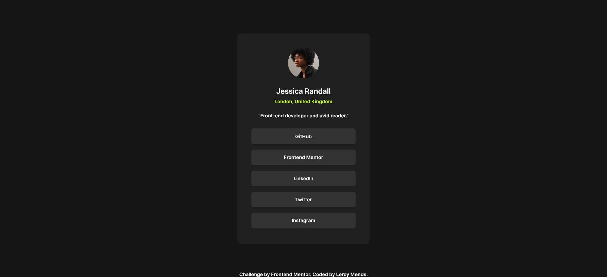
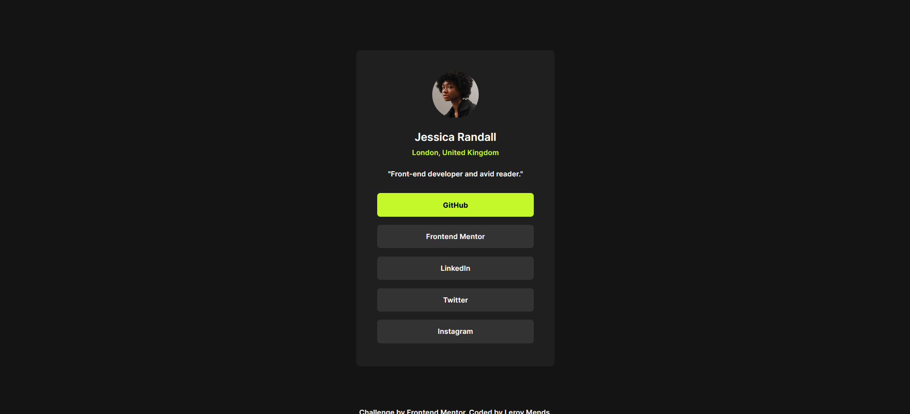
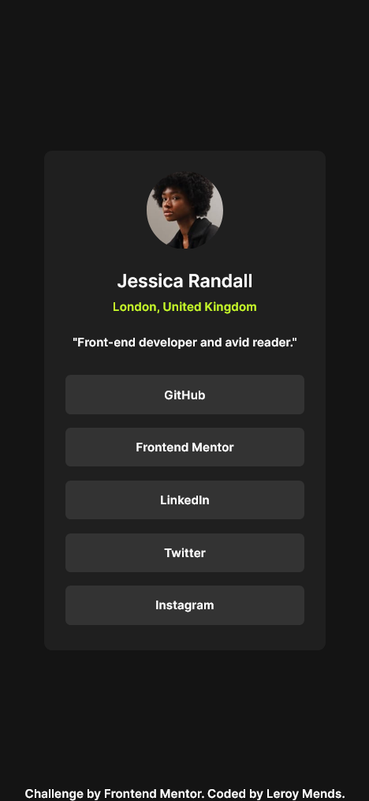

# Frontend Mentor - Social links profile solution

This is a solution to the [Social links profile challenge on Frontend Mentor](https://www.frontendmentor.io/challenges/social-links-profile-UG32l9m6dQ). Frontend Mentor challenges help you improve your coding skills by building realistic projects. 

## Table of contents

- [Overview](#overview)
  - [The challenge](#the-challenge)
  - [Screenshot](#screenshot)
  - [Links](#links)
- [My process](#my-process)
  - [Built with](#built-with)
  - [What I learned](#what-i-learned)
  - [Continued development](#continued-development)
- [Author](#author)

## Overview

### The challenge

Users should be able to:

- See hover and focus states for all interactive elements on the page

### Screenshot





### Links

- Solution URL: [Frontend Mentor Solutions](https://www.frontendmentor.io/solutions/responsive-social-profile-link-card-using-css-flexbox-and-css-grid-rBUdMQTzi3#comment-6a3dccc628d578c87e6d06f3)
- Live Site URL: [Social Profiles Links](https://social-profiles-webpage.vercel.app/)

## My process
- First I built my own Web design using figma
- The design was bulit in a way that would remind me how I would have coded my design.
- Using the figma design I created using the design Images, I was able to extract the dimensions needed for my website.
- I then built the website using these dimensions.
- I then decided after building the website to test its responsiveness, using the wcag requirements of cause.
- After testing and debugging my code, I placed it in github and used vercel to publish it.

### Built with

- Semantic HTML5 markup
- CSS custom properties
- Flexbox
- CSS Grid

### What I learned

```html
<h1 id="proud">Some HTML code I'm proud of</h1>
```
```css
#proud {
  position: absolute;
  bottom: 0;
}
```

### Continued development

I want to keep developing myself in html semantics and proper code arrngements.

## Author

- Website - [Leroy Mends](https://social-profiles-webpage.vercel.app/)
- Frontend Mentor - [@mpartisan1000](https://www.frontendmentor.io/profile/mpartisan1000)

